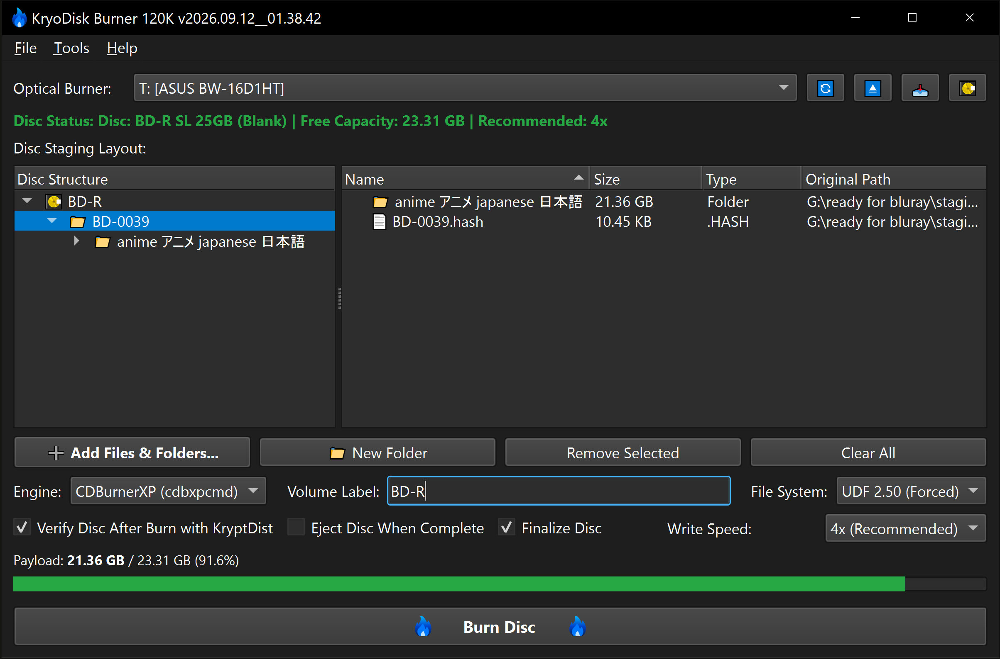

#  KryoDisk Burner 120K™ 
**A high-performance optical disc authoring and burning utility supporting CD, DVD, Blu-ray, and BDXL media formatted in UDF 2.50 / UDF 2.60.**

---

## Overview
KryoDisk Burner 120K™ is a dedicated optical disc authoring and burning application for Windows. Utilizing integrated **CDBurnerXP CLI (cdbxpcmd.exe)** and **ImgBurn / ImgBurnPortable** engines alongside the Windows Image Mastering API v2.0 (IMAPI2), it authors compliant **Universal Disk Format (UDF 2.50 / UDF 2.60)** file systems and writes finalized single-session discs to CD, DVD, Blu-ray (BD-R), and high-density BDXL media (up to 128GB Quad-Layer).

**Primary Environment:** Developed and tested on **Python 3.14.5** using the **PyQt6** framework and **pywin32** COM interfaces. It is designed for archivists, system administrators, and storage specialists who require reliable optical media authoring, guaranteed session finalization, configurable burning backends, and seamless post-burn cryptographic integrity verification.

### The Authoring & Burning Engine
The utility couples direct COM-level hardware communication with an intuitive dual-pane disc layout manager, configurable burning backends, and automated post-burn verification.

Key operational features include:
1. **Universal Optical Media Support:** Authors and writes directly to standard write-once optical formats: CD-R, DVD-R, DVD+R, DVD±R DL (Dual Layer), BD-R (25GB), BD-R DL (50GB), BD-R TL (100GB BDXL), and BD-R QL (128GB BDXL). Rewritable media (CD-RW, DVD±RW, BD-RE) is strictly restricted to `-DevDebug` mode for development and scratch testing.
2. **Instant Rewritable Overwrites & Erased Capacity:** In `-DevDebug` mode, burning to rewritable media evaluates staged payloads against the full erased physical capacity rather than leftover slack space. The action button dynamically updates to **Erase & Burn Disc**, automatically performing sub-second descriptor zeroing or auto-confirmed overwrite passes across CDBurnerXP and ImgBurn without slow manual blanking cycles.
3. **Dual Burning Engine Architecture:** Choose between **CDBurnerXP CLI** (`cdbxpcmd.exe`) for headless track-level burning or **ImgBurn (long paths)** (`ImgBurn.exe`) for custom UDF 2.50 and UDF 2.60 authoring. All ImgBurn sessions author strictly pure UDF (ISO9660 completely disabled) to eliminate 2GB/4GB file size limits and directory depth constraints, paired with UTF-8 BOM source lists and instant virtual layout staging.
4. **Dual-Pane Staging Browser:** Structure your disc hierarchy using a dedicated left navigation tree and right contents view. Create virtual folders, stage custom directory trees, and remove individual files from added folders freely without engine path collisions.
5. **Dynamic Path Length Validation:** Live status indicator actively monitors staged file and folder paths based on the selected engine: enforces standard Win32 limits (260 characters for files, 248 characters for directories) for CDBurnerXP, or true UDF 2.50 specifications (max 127 characters per individual file/folder name component, and up to 511 characters cumulative path length) for ImgBurn (long paths).
6. **Full Unicode & Japanese Character Sets:** End-to-end UTF-8 and Unicode pipeline across disc staging, UDF authoring, and post-burn verification. Complete native support for Japanese (Kanji, Hiragana, Katakana), CJK, Cyrillic, accents, and international symbols across all filenames, paths, manifests, and verification pipes.
7. **Dual-Explorer Add Dialog:** Browse local drives and stage multiple files and directories simultaneously through an integrated dual-pane file and folder picker.
8. **Physical Disc Inspection:** Direct hardware inspection tool (💽) to explore and browse the physical file contents of the currently inserted disc without leaving the application.
9. **Administrator & Hardware Elevation:** Operates with Administrator privileges to secure exclusive hardware access to optical burner drives and prevent `0x80070005 E_ACCESSDENIED` device lock errors. Add files via the built-in dual-explorer dialog or the Windows SendTo menu.
10. **Real-Time Capacity Gauging:** Dynamically gauges staged payload sizes against inserted optical disc capacity, complete with visual color changes and over-capacity warnings.
11. **Guaranteed Session Finalization:** All burns are automatically closed and finalized upon completion to guarantee broad compatibility across standard optical drives, standalone media players, and long-term cold storage archives.
12. **Hardware Tray Eject & Motorized Close:** Direct hardware controls to eject (⏏) and close/load (📥) optical drive trays via kernel IOCTL and MCI interfaces.
13. **Dynamic Write Speed Configuration:** Queries drive firmware to expose valid write speed multipliers (e.g. 1x, 2x, 4x, 8x, 16x, 24x) alongside automatic maximum speed handling and media-specific sweet spot recommendations.
14. **Pre-Burn Verify Time Estimation & Persistent Session ETA:** Pre-calculates verification time at 0% based on realistic optical read throughput profiles, head seek latency (~150ms per staged file), and drive remount overhead. The session total duration is established once at launch and persists across both burning and verification for a smooth, non-jittering countdown.
15. **Primary Checksum Guard & Verification:** When verification is enabled, KryoDisk checks the disc root (depth 0) and immediate top-level folders (depth 1) for a primary checksum manifest (`.hash`, `.b3`, `.sha256`, etc.) prior to burning, prompting to disable verification or cancel if missing. Post-burn, a 25-second thermal cooldown allows the optical pickup unit and laser diode to stabilize, followed by a software volume dismount (`FSCTL_DISMOUNT_VOLUME`) to flush Windows sector caches without requiring physical tray cycling. An asynchronous 15-second mount probe then guards against corrupt burns before launching **KryptDist** (`KryptDist.py`) to verify data integrity under an active 20-second stall watchdog timer.
16. **Operation Log Duration Summary:** Completed sessions conclude with an audit log summary reporting the grand total elapsed time alongside the exact burn duration and verification duration breakdown.
17. **Engines & Preferences Organization:** Centralized **Tools > Preferences** dialog partitioned into **Engines** (custom executable/script path discovery and auto-detection for CDBurnerXP, ImgBurn, and KryptDist) and **Notifications** (customizable spoken audio voice announcers and event toggles).
18. **Developer Debug & Quick Erase:** When launched with `-DevDebug`, unlocks the Quick Erase tool (🧹) powered by CDBurnerXP CLI and Windows IMAPI2 multi-descriptor zeroing to blank test rewritable media (BD-RE, DVD-RW, CD-RW), enables verbose console telemetry, and maintains independent session preferences.
19. **Fast Startup Bypass:** Supports `-NoDriveScan` (or `-NoScan` / `-SkipDriveScan`) with `-DevDebug` to bypass the initial 5-second optical hardware query and media spin-up on startup for instantaneous application launch.
20. **Spoken Voice Notifications & Themed UI:** Full support for Dark, Light, and System-synced palettes, paired with Kokoro TTS spoken audio announcements (**River** [USA female] and **Lily** [GB female]) for individual completion and failure events, with a master mute toggle that grays out inactive controls.
21. **Persistent State Management:** Remembers window geometry, write speed preferences, disc labels, verification settings, custom engine paths, and theme configurations across sessions.

---

## Feature Reference

| Option / Feature | Description |
| :--- | :--- |
| **Dual Burning Engines** | Select between CDBurnerXP CLI (`cdbxpcmd.exe`) and ImgBurn (long paths) (`ImgBurn.exe`) backends. |
| **UDF 2.50 & 2.60 Mastering** | Builds compliant Universal Disk Format virtual file systems; ImgBurn mode authors strictly pure UDF (ISO9660 disabled). |
| **BDXL & Multi-Format Support** | Complete support for CD-R, DVD±R, Blu-ray, and multi-layer BDXL media up to 128GB Quad-Layer (QL). |
| **Dual-Pane Layout Browser** | Split hierarchical browser for organizing virtual disc directories and staged payloads. |
| **Live Path Length Validator** | Real-time monitoring of active engine path limits (Win32 260/248 for CDBurnerXP; UDF 2.50 127 char name / 511 char path for ImgBurn). |
| **Unicode & Japanese Characters** | Full end-to-end UTF-8 pipeline supporting Japanese (Kanji, Hiragana, Katakana), CJK, Cyrillic, and international symbols. |
| **Dual-Explorer Add Dialog** | Simultaneous file and directory picker for quick batch staging. |
| **Physical Disc Explorer (💽)** | Integrated browser dialog to inspect files physically present on the inserted disc. |
| **Live Capacity Meter** | Real-time visual capacity bar displaying payload usage against media capacity with overload warnings. |
| **Guaranteed Session Finalization** | Finalizes disc sessions on completion to ensure long-term archival data integrity. |
| **Hardware Tray Controls** | Direct software-driven drive tray eject (⏏) and motorized tray close (📥) commands. |
| **Hardware Speed Descriptors** | Queries drive firmware for supported disc write multipliers with recommended presets. |
| **Pre-Burn Verify Estimation** | Models physical optical throughput, seek latencies, and remount overhead for accurate pre-burn ETAs. |
| **Persistent Session Countdown**| Establishes a 0% baseline session estimate that persists jitter-free across both burn and verify phases. |
| **Primary Checksum Guard** | Validates presence of a primary `.hash` at disc root or depth-1 folders before burning; prevents false matches on nested files. |
| **Thermal Cooldown & Cache Flush** | 25s settling countdown and software volume dismount (`FSCTL_DISMOUNT_VOLUME`) flush OS sector cache without physical tray cycling. |
| **Fast Disc Check Guard** | Asynchronous 15s background mount check catches bad burns and unreadable media without UI lockups. |
| **KryptDist Post-Burn Check** | Scans burned discs for primary manifest and verifies 100% bit-level data integrity, guarded by a 20s stall watchdog. |
| **Total Elapsed Time Reporting**| Logs a complete elapsed duration summary (total time, burn time, verify time) at the close of every session. |
| **Erase & Burn Disc (DevDebug)** | Evaluates rewritable media by total physical erased size; dynamic action button overwrites data seamlessly. |
| **Preferences & Engine Paths** | Configure and auto-detect paths for CDBurnerXP, ImgBurn, and KryptDist under **Tools > Preferences > Engines**. |
| **Voice Audio Notifications** | Spoken voice announcements powered by Kokoro TTS (River & Lily) with individual event checkboxes and gray-out mute styling. |
| **Quick Erase (🧹) [DevDebug]** | Rapidly blanks volume descriptors on rewritable media (BD-RE, DVD-RW, CD-RW) via CDBurnerXP CLI. |
| **Instant Launch Flag** | Run with `-DevDebug -NoDriveScan` to bypass startup drive queries for instant launch. |
| **Theme Engine** | Full support for Dark, Light, and System-synced palettes via custom `QPalette` implementation. |

---

## Command Line Flags & DevDebug Mode

| Flag | Description |
| :--- | :--- |
| `-DevDebug` | Activates verbose console logging, unlocks the Quick Erase (🧹) tool on the toolbar, and enables rewritable media workflows. |
| `-NoDriveScan` `-NoScan` `-SkipDriveScan` | When used in conjunction with `-DevDebug`, bypasses the 5-second optical hardware query and disc spin-up on startup. Click **🔄** to query hardware on demand. |

---

## Post-Burn Verification Integration

KryoDisk Burner 120K seamlessly pairs with **KryptDist** (`KryptDist.py`) for end-to-end data integrity validation:
1. Place a primary `.hash` manifest (or any supported checksum file: `.b3`, `.sha256`, `.sha512`, `.xxh3`, etc.) directly at the disc root or inside the primary top-level folder (depth 1, e.g. `\BD-0025\BD-0025.hash`).
2. Ensure `Verify Disc After Burn with KryptDist` is checked. When clicking Burn, KryoDisk automatically validates the presence of the primary checksum file; if missing, it prompts to disable verification and burn, or cancel to stage the container.
3. Upon burn completion, KryoDisk initiates a 25-second thermal cool-down pause to allow the laser diode and optical pickup assembly to stabilize, followed by a software volume dismount (`FSCTL_DISMOUNT_VOLUME`) to flush stale Windows sector caches without requiring physical tray cycling. An asynchronous 15-second filesystem mount probe then checks media readability to guard against bad burns or damaged volume descriptors.
4. Once confirmed accessible, KryoDisk Burner inspects the disc root and immediate top-level folders for the primary manifest (avoiding accidental matches on deep internal test hashes) and invokes `KryptDist.py` headlessly under an active 20-second stall watchdog timer to verify every file bit-by-bit, with full real-time progress tracking across Japanese (Kanji, Hiragana, Katakana) and Unicode paths while automatically aborting if the drive hangs.
5. If `Eject Disc When Complete` is checked, disc ejection is safely deferred until verification passes with 100% integrity.
6. Plays the configured Kokoro TTS spoken audio announcement (`burn_completed_and_verified` or `verify_failed`) and displays an alert dialog with full audit logging.

---

## Engine & Script Discovery

Burning backends and verification scripts are automatically discovered in the following order:
1. Custom configured paths set in **Tools > Preferences > Engines**.
2. User and System `PATH` environment variables (including new additions prior to reboot).
3. `KryoDisk-Burner-120K_internal\bin\` directories (`cdbxpcmd.exe`, `ImgBurnPortable\`, `KryptDist.py`).
4. `C:\tools\` and `C:\scripts\` tool installations (`C:\tools\CDBurnerXP\`, `C:\tools\ImgBurnPortable\`, `C:\scripts\KryptDist.py`).
5. Standard 32-bit and 64-bit `Program Files` installations.

---

## Assets & Licensing
This software is released under the **GNU General Public License v3**.

### Icon Credits
* **File:** `kryodisk-burner-120k-icon.svg`
    * **Asset:** Fire SVG Vector
    * **Source:** <a href="https://www.svgrepo.com/svg/506715/fire" target="_blank">https://www.svgrepo.com/svg/506715/fire</a>
    * **License:** <a href="https://creativecommons.org/publicdomain/zero/1.0/" target="_blank">CC0 License</a>
    * **Modifications:** Modified by pwshAgyjkcrg761.

### Audio Notification Credits
* **Engine:** <a href="https://huggingface.co/spaces/hexgrad/Kokoro-TTS" target="_blank">Kokoro TTS</a>
    * **Asset:** Voice audio notifications (`burn_completed`, `burn_completed_and_verified`, `burn_failed`, `verify_failed`)
    * **Voices:** River (USA female) and Lily (Great Britain female)
    * **License:** <a href="https://creativecommons.org/publicdomain/zero/1.0/" target="_blank">CC0 License</a>

---

## Dependencies
* **OS:** Microsoft Windows 10 / 11 / Windows Server (64-bit).
* **Privileges:** Administrator privileges required for exclusive optical burner hardware access.
* **Python:** 3.14.5+ (Recommended).
* **PyQt6:** Required for the Graphical User Interface framework (`pip install PyQt6`).
* **pywin32:** Required for Windows IMAPI2 COM hardware queries (`pip install pywin32`).
* **Burning Backends:** **<a href="https://sourceforge.net/projects/cdburnerxp/" target="_blank">CDBurnerXP</a> CLI** (`cdbxpcmd.exe`) or **<a href="https://www.imgburn.com/" target="_blank">ImgBurn</a>** (`ImgBurn.exe` / `ImgBurnPortable`).
* **Optional Tooling:** <a href="https://git.disroot.org/pwshAgyjkcrg761/KryptDist-py.git" target="_blank">`KryptDist.py`</a> (located in the application directory, `C:\scripts\`, `C:\tools\`, or configured in Preferences) for automated post-burn cryptographic checksum verification.

## Support & Maintenance
**This repository is provided "as-is" for archival purposes.** The author is not actively looking for feedback, feature requests, or bug reports. The issue tracker is disabled.

## Disclaimer
*KryoDisk Burner 120K™ is an optical disc authoring and burning utility. Burning to write-once optical media (CD-R, DVD-R, BD-R) involves permanent physical modification of the disc. The author is not responsible for failed burns, drive hardware faults, or data loss resulting from hardware failure or improper handling. Always verify critical backups.*

---
> **Document Control** 
> *This document is up-to-date with the following version of KryoDisk Burner 120K™.* 
> *2026.09.29__19.58.49*